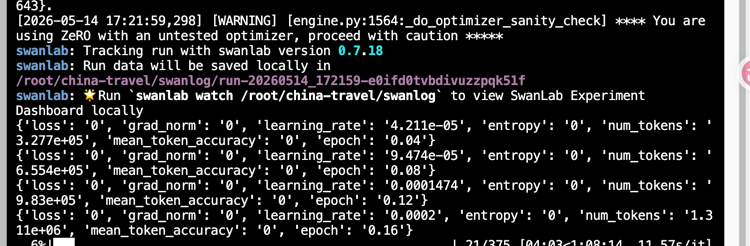
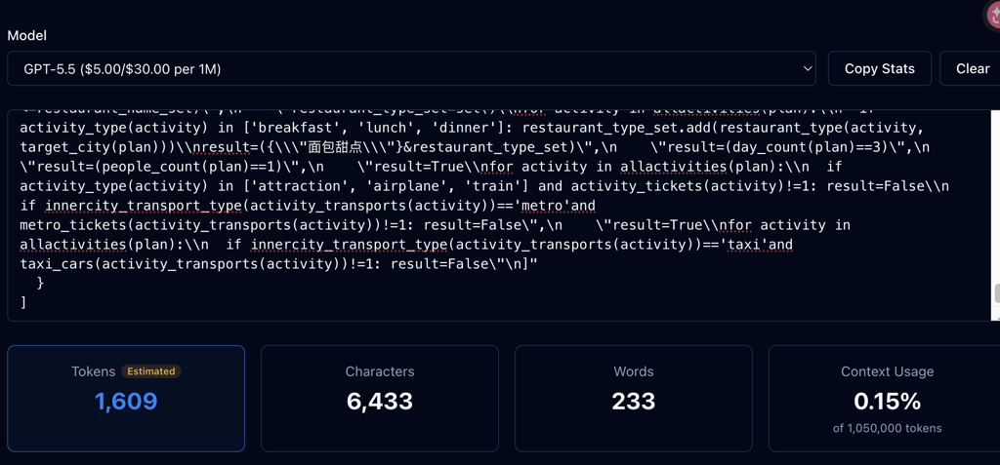

deepspeed-zero1
```bash
python -m accelerate.commands.launch \
  --num_processes 2 \
  --num_machines 1 \
  --mixed_precision bf16 \
  --use_deepspeed \
  --deepspeed_config_file ds_config.json \
  train_sft.py
```
包安装
```bash
pip install torch transformers datasets accelerate peft trl bitsandbytes deepspeed python-dotenv swanlab -i https://pypi.tuna.tsinghua.edu.cn/simple
```
加载数据
```bash
python data/load_data.py
```
swanlab dashboard
```bash
pip install "swanlab[dashboard]"
```

查看日志和loss、lr等等
```bash
swanlab watch
```


过程中的问题

loss=0 应该是没有生成内容，考虑是不是上下文问题,运行load_data里的测试
```
============================== 1. Messages 格式预览 ==============================
[
  {
    "role": "system",
    "content": "\n你是一个专业的旅游规划逻辑解析引擎。请根据用户提供的已知基础行程信息和自然语言补充要求，直接输出包含所有Python逻辑约束的JSON列表。\n\n可用的函数库文档如下：\n\n(1)day_count(plan)\n文档(Docs)：获取行程(plan)中的天数。\n返回值(Return)：整数(int)\n\n(2)people_count(plan)\n文档(Docs)：获取行程(plan)中的人数。\n返回值(Return)：整数(int)\n\n(3)start_city(plan)\n文档(Docs)：获取行程(plan)的出发城市。\n返回值(Return)：字符串(str)\n\n(4)target_city(plan)\n文档(Docs)：获取行程(plan)的目标城市。\n返回值(Return)：字符串(str)\n\n(5)allactivities(plan)\n文档(Docs)：获取行程(plan)中的所有活动。\n返回值(Return)：活动列表(list of activities)\n\n(6)allactivities_count(plan)\n文档(Docs)：获取行程(plan)中的活动数量。\n返回值(Return)：整数(int)\n\n(7)dayactivities(plan, day)\n文档(Docs)：获取特定天数(day，取值为[1, 2, 3, ...])内的所有活动。\n返回值(Return)：活动列表(list of activities)\n\n(8)activity_cost(activity)\n文档(Docs)：获取特定活动(activity)的费用，不包含交通费用。\n返回值(Return)：浮点数(float)\n\n(9)activity_position(activity)\n文档(Docs)：获取特定活动(activity)的具体地点或具体名称，比如住宿类活动的名称、餐厅名称、活动名称。如果想获得活动的具体类型，请对餐厅类活动用restaurant_type(activity, target_city(plan))，对景点类活动用attraction_type(activity, target_city(plan))，对住宿类活动用accommodation_type(activity, target_city(plan))。如果没有匹配这三个函数，可以用activity_position(activity)。\n返回值(Return)：字符串(str)\n\n(10)activity_price(activity)\n文档(Docs)：获取特定活动(activity)的价格，该价格为单人价格。\n返回值(Return)：浮点数(float)\n\n(11)activity_type(activity)\n文档(Docs)：获取特定活动(activity)的类型，类型包含['breakfast'(早餐), 'lunch'(午餐), 'dinner'(晚餐), 'attraction'(景点), 'accommodation'(住宿), 'train'(火车), 'airplane'(飞机)]。\n返回值(Return)：字符串(str)\n\n(12)activity_tickets(activity)\n文档(Docs)：获取特定活动(activity)所需的票数，适用于['attraction'(景点), 'train'(火车), 'airplane'(飞机)]类型的活动。\n返回值(Return)：整数(int)\n\n(13)activity_transports(activity)\n文档(Docs)：获取特定活动(activity)的交通信息。\n返回值(Return)：字典列表(list of dict)\n\n(14)activity_start_time(activity)\n文档(Docs)：获取特定活动(activity)的开始时间。\n返回值(Return)：字符串(str)\n\n(15)activity_end_time(activity)\n文档(Docs)：获取特定活动(activity)的结束时间。\n返回值(Return)：字符串(str)\n\n(16)activity_time(activity)\n文档(Docs)：获取特定活动(activity)的持续时长。\n返回值(Return)：整数(int)，单位为分钟(minutes)\n\n(17)innercity_transport_cost(transports)\n文档(Docs)：获取市内交通(transports)的总费用。\n返回值(Return)：浮点数(float)\n\n(18)poi_recommend_time(city, poi)\n文档(Docs)：获取某城市(city)内特定兴趣点(poi)的推荐游览时长，目前仅支持景点类型的兴趣点。\n返回值(Return)：整数(int)，单位为分钟(minutes)\n\n(19)poi_distance(city, poi1, poi2)\n文档(Docs)：获取某城市(city)内两个兴趣点(poi1、poi2)之间的距离。\n返回值(Return)：浮点数(float)，单位为千米(km)\n\n(20)innercity_transport_price(transports)\n文档(Docs)：获取市内交通(transports)的价格，该价格为单人价格。\n返回值(Return)：浮点数(float)\n\n(21)innercity_transport_distance(transports)\n文档(Docs)：获取市内交通(transports)的行程距离。\n返回值(Return)：浮点数(float)，单位为千米(km)\n\n(22)metro_tickets(transports)\n文档(Docs)：若交通类型为地铁，获取地铁票的数量。\n返回值(Return)：整数(int)\n\n(23)taxi_cars(transports)\n文档(Docs)：若交通类型为出租车，获取出租车的数量，出租车数量按公式`(people_count(plan) + 3) // 4`计算。\n返回值(Return)：整数(int)\n\n(24)room_count(activity)\n文档(Docs)：获取住宿类活动(activity)的房间数量。\n返回值(Return)：整数(int)\n\n(25)room_type(activity)\n文档(Docs)：获取住宿类活动(activity)的房间类型，1代表单人房(single room)，2代表双人房(double room)，取值只能是1或2，禁止使用“大床房”“双床房”或其他表述。\n返回值(Return)：整数(int)\n\n(26)restaurant_type(activity, target_city)\n文档(Docs)：获取目标城市(target_city)内餐厅类活动(activity)的菜系类型，返回值必须来自['云南菜', '西藏菜', '东北菜', '烧烤', '亚洲菜', '粤菜', '西北菜', '闽菜', '客家菜', '快餐简餐', '川菜', '台湾菜', '其他', '清真菜', '小吃', '西餐', '素食', '日本料理', '江浙菜', '湖北菜', '东南亚菜', '湘菜', '北京菜', '韩国料理', '海鲜', '中东料理', '融合菜', '茶馆/茶室', '酒吧/酒馆', '创意菜', '自助餐', '咖啡店', '本帮菜', '徽菜', '拉美料理', '鲁菜', '新疆菜', '农家菜', '海南菜', '火锅', '面包甜点', '其他中餐']。\n返回值(Return)：字符串(str)\n\n(27)attraction_type(activity, target_city)\n文档(Docs)：获取目标城市(target_city)内景点类活动(activity)的类型，返回值必须来自['博物馆/纪念馆', '美术馆/艺术馆', '红色景点', '自然风光', '人文景观', '大学校园', '历史古迹', '游乐园/体育娱乐', '图书馆', '园林', '其它', '文化旅游区', '公园', '商业街区']。\n返回值(Return)：字符串(str)\n\n(28)accommodation_type(activity, target_city)\n文档(Docs)：获取目标城市(target_city)内住宿类活动(activity)的特色，用于判断其是否符合用户需求，返回值必须来自['儿童俱乐部', '空气净化器', '山景房', '私汤房', '四合院', '温泉', '湖畔美居', '电竞酒店', '温泉泡汤', '行政酒廊', '充电桩', '设计师酒店', '民宿', '湖景房', '动人夜景', '行李寄存', '中式庭院', '桌球室', '私人泳池', '钓鱼', '迷人海景', '园林建筑', '老洋房', '儿童泳池', '历史名宅', '棋牌室', '智能客控', '情侣房', '小而美', '特色住宿', '茶室', '亲子主题房', '多功能厅', '洗衣房', '客栈', '自营亲子房', '停车场', 'Boss推荐', '江河景房', '日光浴场', '自营影音房', '厨房', '空调', '网红泳池', '别墅', '免费停车', '洗衣服务', '窗外好景', '酒店公寓', '会议厅', '家庭房', '24小时前台', '商务中心', '提前入园', '农家乐', '智能马桶', '美食酒店', 'SPA', '拍照出片', '海景房', '泳池', '影音房', '管家服务', '穿梭机场班车', '桑拿', '机器人服务', '儿童乐园', '健身室', '洗衣机', '自营舒睡房', '宠物友好', '电竞房', '位置超好', '套房']。\n返回值(Return)：字符串(str)\n\n(29)innercity_transport_type(transports)\n文档(Docs)：获取市内交通(transports)的类型，返回值必须来自['metro'(地铁), 'taxi'(出租车), 'walk'(步行)]。\n返回值(Return)：字符串(str)\n\n(30)innercity_transport_start_time(transports)\n文档(Docs)：获取市内交通(transports)的出发时间。\n返回值(Return)：字符串(str)\n\n(31)innercity_transport_end_time(transports)\n文档(Docs)：获取市内交通(transports)的到达时间。\n返回值(Return)：字符串(str)\n\n(32)intercity_transport_type(activity)\n文档(Docs)：获取城际交通类活动(activity)的类型，返回值必须来自['train'(火车), 'airplane'(飞机)]。\n返回值(Return)：字符串(str)\n\n(33)innercity_transport_time(transports)\n文档(Docs)：获取市内交通(transports)的行程时长。\n返回值(Return)：整数(int)，单位为分钟(minutes)\n\n(34)intercity_transport_origin(activity)\n文档(Docs)：获取城际交通类活动(activity)的出发城市。\n返回值(Return)：字符串(str)\n\n(35)intercity_transport_destination(activity)\n文档(Docs)：获取城际交通类活动(activity)的到达城市。\n返回值(Return)：字符串(str)\n\n"
  },
  {
    "role": "user",
    "content": "我们1人，从北京出发，到深圳旅行3天，要求如下：\n希望尝试以下餐厅：宇德隆记客家食府(龙华店)\n希望尝试以下类型的餐厅之一面包甜点"
  },
  {
    "role": "assistant",
    "content": "[\n    \"restaurant_name_set=set()\\nfor activity in allactivities(plan):\\n  if activity_type(activity) in ['breakfast', 'lunch', 'dinner']: restaurant_name_set.add(activity_position(activity))\\nresult=({\\\"宇德隆记客家食府(龙华店)\\\"}<=restaurant_name_set)\",\n    \"restaurant_type_set=set()\\nfor activity in allactivities(plan):\\n  if activity_type(activity) in ['breakfast', 'lunch', 'dinner']: restaurant_type_set.add(restaurant_type(activity, target_city(plan)))\\nresult=({\\\"面包甜点\\\"}&restaurant_type_set)\",\n    \"result=(day_count(plan)==3)\",\n    \"result=(people_count(plan)==1)\",\n    \"result=True\\nfor activity in allactivities(plan):\\n  if activity_type(activity) in ['attraction', 'airplane', 'train'] and activity_tickets(activity)!=1: result=False\\n  if innercity_transport_type(activity_transports(activity))=='metro'and metro_tickets(activity_transports(activity))!=1: result=False\",\n    \"result=True\\nfor activity in allactivities(plan):\\n  if innercity_transport_type(activity_transports(activity))=='taxi'and taxi_cars(activity_transports(activity))!=1: result=False\"\n]"
  }
]

============================== 2. Tokenizer 真实输入预览 ==============================
{'input_ids': [151644, 8948, 271, 56568, 101909, 104715, 99790, 100367, 104913, 106637, 102977, 1773, 14880, 100345, 20002, 103008, 36667, 52183, 99896, 106318, 27369, 33108, 99795, 102064, 104361, 101882, 3837, 101041, 66017, 102298, 55338, 30280, 104913, 105852, 9370, 5370, 44177, 3407, 107769, 9370, 32804, 44956, 111116, 104506, 48443, 7, 16, 8, 1292, 3180, 74727, 340, 111116, 5432, 14128, 8, 5122, 45912, 106318, 74727, 8, 101047, 35727, 8863, 8997, 31526, 25511, 87574, 8, 5122, 63431, 8863, 1548, 692, 7, 17, 8, 16069, 3180, 74727, 340, 111116, 5432, 14128, 8, 5122, 45912, 106318, 74727, 8, 15946, 100623, 8863, 8997, 31526, 25511, 87574, 8, 5122, 63431, 8863, 1548, 692, 7, 18, 8, 2468, 24971, 74727, 340, 111116, 5432, 14128, 8, 5122, 45912, 106318, 74727, 8, 9370, 104532, 99490, 8997, 31526, 25511, 87574, 8, 5122, 66558, 4199, 692, 7, 19, 8, 5657, 24971, 74727, 340, 111116, 5432, 14128, 8, 5122, 45912, 106318, 74727, 8, 104820, 99490, 8997, 31526, 25511, 87574, 8, 5122, 66558, 4199, 692, 7, 20, 8, 541, 31978, 74727, 340, 111116, 5432, 14128, 8, 5122, 45912, 106318, 74727, 8, 101047, 55338, 99600, 8997, 31526, 25511, 87574, 8, 5122, 99600, 44177, 7307, 315, 7488, 692, 7, 21, 8, 541, 31978, 3180, 74727, 340, 111116, 5432, 14128, 8, 5122, 45912, 106318, 74727, 8, 101047, 99600, 81800, 8997, 31526, 25511, 87574, 8, 5122, 63431, 8863, 1548, 692, 7, 22, 8, 1292, 31978, 74727, 11, 1899, 340, 111116, 5432, 14128, 8, 5122, 45912, 105149, 35727, 8863, 37334, 3837, 18158, 25511, 17714, 58, 16, 11, 220, 17, 11, 220, 18, 11, 2503, 2467, 102595, 55338, 99600, 8997, 31526, 25511, 87574, 8, 5122, 99600, 44177, 7307, 315, 7488, 692, 7, 23, 8, 7175, 15890, 30212, 340, 111116, 5432, 14128, 8, 5122, 45912, 105149, 99600, 30212, 8, 9370, 103966, 3837, 16530, 102298, 99735, 103966, 8997, 31526, 25511, 87574, 8, 5122, 100825, 27442, 8863, 8268, 692, 7, 24, 8, 7175, 9661, 30212, 340, 111116, 5432, 14128, 8, 5122, 45912, 105149, 99600, 30212, 8, 106708, 104766, 57191, 100398, 29991, 3837, 101912, 106285, 21515, 99600, 9370, 29991, 5373, 104835, 29991, 5373, 99600, 29991, 1773, 62244, 99172, 100350, 99600, 106708, 31905, 37945, 32664, 104835, 21515, 99600, 11622, 33226, 1819, 30212, 11, 2169, 24971, 74727, 593, 3837, 32664, 105869, 21515, 99600, 11622, 2991, 1311, 1819, 30212, 11, 2169, 24971, 74727, 593, 3837, 32664, 106285, 21515, 99600, 11622, 71987, 68511, 1819, 30212, 11, 2169, 24971, 74727, 593, 1773, 107427, 106188, 112935, 32804, 3837, 106782, 7175, 9661, 30212, 8, 8997, 31526, 25511, 87574, 8, 5122, 66558, 4199, 692, 7, 16, 15, 8, 7175, 9040, 30212, 340, 111116, 5432, 14128, 8, 5122, 45912, 105149, 99600, 30212, 8, 104968, 3837, 75882, 97480, 17714, 23990, 17340, 97480, 8997, 31526, 25511, 87574, 8, 5122, 100825, 27442, 8863, 8268, 692, 7, 16, 16, 8, 7175, 1819, 30212, 340, 111116, 5432, 14128, 8, 5122, 45912, 105149, 99600, 30212, 8, 9370, 31905, 3837, 31905, 102298, 677, 8960, 9349, 58336, 102589, 701, 364, 75, 3185, 58336, 111480, 701, 364, 67, 4382, 58336, 110653, 701, 364, 2991, 1311, 58336, 105869, 701, 364, 71987, 68511, 58336, 106285, 701, 364, 10397, 58336, 102815, 701, 364, 1310, 19025, 58336, 104410, 7252, 8997, 31526, 25511, 87574, 8, 5122, 66558, 4199, 692, 7, 16, 17, 8, 7175, 91836, 30212, 340, 111116, 5432, 14128, 8, 5122, 45912, 105149, 99600, 30212, 8, 109988, 94444, 8863, 3837, 106584, 677, 2991, 1311, 58336, 105869, 701, 364, 10397, 58336, 102815, 701, 364, 1310, 19025, 58336, 104410, 7252, 109963, 99600, 8997, 31526, 25511, 87574, 8, 5122, 63431, 8863, 1548, 692, 7, 16, 18, 8, 7175, 7965, 3394, 30212, 340, 111116, 5432, 14128, 8, 5122, 45912, 105149, 99600, 30212, 8, 9370, 99735, 27369, 8997, 31526, 25511, 87574, 8, 5122, 18600, 99548, 44177, 7307, 315, 6451, 692, 7, 16, 19, 8, 7175, 4906, 3009, 30212, 340, 111116, 5432, 14128, 8, 5122, 45912, 105149, 99600, 30212, 8, 9370, 55286, 20450, 8997, 31526, 25511, 87574, 8, 5122, 66558, 4199, 692, 7, 16, 20, 8, 7175, 6213, 3009, 30212, 340, 111116, 5432, 14128, 8, 5122, 45912, 105149, 99600, 30212, 8, 9370, 80565, 20450, 8997, 31526, 25511, 87574, 8, 5122, 66558, 4199, 692, 7, 16, 21, 8, 7175, 3009, 30212, 340, 111116, 5432, 14128, 8, 5122, 45912, 105149, 99600, 30212, 8, 9370, 100652, 13343, 45861, 8997, 31526, 25511, 87574, 8, 5122, 63431, 8863, 1548, 69515, 75317, 17714, 83031, 76659, 692, 7, 16, 22, 8, 4382, 8926, 46398, 15890, 33089, 3394, 340, 111116, 5432, 14128, 8, 5122, 45912, 22697, 31843, 99735, 33089, 3394, 8, 9370, 59743, 103966, 8997, 31526, 25511, 87574, 8, 5122, 100825, 27442, 8863, 8268, 692, 7, 16, 23, 8, 82263, 99084, 3009, 43502, 11, 46927, 340, 111116, 5432, 14128, 8, 5122, 45912, 99569, 99490, 43502, 8, 31843, 105149, 100565, 27442, 1295, 6728, 8, 9370, 101914, 107871, 13343, 45861, 3837, 100004, 99373, 100143, 105869, 109963, 100565, 27442, 8997, 31526, 25511, 87574, 8, 5122, 63431, 8863, 1548, 69515, 75317, 17714, 83031, 76659, 692, 7, 16, 24, 8, 82263, 19464, 43502, 11, 46927, 16, 11, 46927, 17, 340, 111116, 5432, 14128, 8, 5122, 45912, 99569, 99490, 43502, 8, 31843, 100369, 100565, 27442, 1295, 6728, 16, 5373, 82263, 17, 8, 104186, 100764, 8997, 31526, 25511, 87574, 8, 5122, 100825, 27442, 8863, 8268, 69515, 75317, 17714, 112925, 5969, 76, 692, 7, 17, 15, 8, 4382, 8926, 46398, 9040, 33089, 3394, 340, 111116, 5432, 14128, 8, 5122, 45912, 22697, 31843, 99735, 33089, 3394, 8, 104968, 3837, 75882, 97480, 17714, 23990, 17340, 97480, 8997, 31526, 25511, 87574, 8, 5122, 100825, 27442, 8863, 8268, 692, 7, 17, 16, 8, 4382, 8926, 46398, 19464, 33089, 3394, 340, 111116, 5432, 14128, 8, 5122, 45912, 22697, 31843, 99735, 33089, 3394, 8, 9370, 106318, 100764, 8997, 31526, 25511, 87574, 8, 5122, 100825, 27442, 8863, 8268, 69515, 75317, 17714, 112925, 5969, 76, 692, 7, 17, 17, 8, 57047, 91836, 33089, 3394, 340, 111116, 5432, 14128, 8, 5122, 100155, 99735, 31905, 17714, 104851, 3837, 45912, 104851, 94444, 110274, 8997, 31526, 25511, 87574, 8, 5122, 63431, 8863, 1548, 692, 7, 17, 18, 8, 17616, 72, 666, 1561, 33089, 3394, 340, 111116, 5432, 14128, 8, 5122, 100155, 99735, 31905, 17714, 107387, 3837, 45912, 107387, 110274, 3837, 107387, 81800, 59879, 110322, 81556, 16069, 3180, 74727, 8, 488, 220, 18, 8, 442, 220, 19, 63, 100768, 8997, 31526, 25511, 87574, 8, 5122, 63431, 8863, 1548, 692, 7, 17, 19, 8, 2966, 3180, 30212, 340, 111116, 5432, 14128, 8, 5122, 45912, 106285, 21515, 99600, 30212, 8, 9370, 102327, 81800, 8997, 31526, 25511, 87574, 8, 5122, 63431, 8863, 1548, 692, 7, 17, 20, 8, 2966, 1819, 30212, 340, 111116, 5432, 14128, 8, 5122, 45912, 106285, 21515, 99600, 30212, 8, 9370, 102327, 31905, 3837, 16, 99661, 23990, 17340, 99218, 89903, 3054, 69515, 17, 99661, 99493, 17340, 99218, 8902, 3054, 69515, 18158, 25511, 101097, 20412, 16, 57191, 17, 3837, 104484, 37029, 2073, 26288, 99830, 99218, 854, 2073, 99493, 99830, 99218, 854, 105994, 112926, 8997, 31526, 25511, 87574, 8, 5122, 63431, 8863, 1548, 692, 7, 17, 21, 8, 33226, 1819, 30212, 11, 2169, 24971, 340, 111116, 5432, 14128, 8, 5122, 45912, 100160, 99490, 8637, 24971, 8, 31843, 104835, 21515, 99600, 30212, 8, 9370, 99800, 38176, 31905, 3837, 31526, 25511, 100645, 101919, 677, 104500, 99800, 516, 364, 105169, 99800, 516, 364, 104756, 99800, 516, 364, 112113, 516, 364, 104320, 99800, 516, 364, 102711, 99800, 516, 364, 105507, 99800, 516, 364, 107509, 99800, 516, 364, 116268, 99800, 516, 364, 113335, 98237, 99512, 516, 364, 100410, 99800, 516, 364, 104109, 99800, 516, 364, 92894, 516, 364, 79766, 88051, 99800, 516, 364, 107600, 516, 364, 60686, 99512, 516, 364, 118974, 516, 364, 101059, 111974, 516, 364, 69177, 100779, 99800, 516, 364, 102251, 99800, 516, 364, 109033, 99800, 516, 364, 101351, 99800, 516, 364, 68990, 99800, 516, 364, 102083, 111974, 516, 364, 109692, 516, 364, 110571, 111974, 516, 364, 101164, 99800, 516, 364, 100019, 99682, 14, 100019, 99478, 516, 364, 108796, 14, 99525, 99682, 516, 364, 102343, 99800, 516, 364, 107380, 99512, 516, 364, 104602, 71416, 516, 364, 21894, 99663, 99800, 516, 364, 101379, 99800, 516, 364, 72225, 57566, 111974, 516, 364, 100221, 99800, 516, 364, 104467, 99800, 516, 364, 103613, 99800, 516, 364, 104345, 99800, 516, 364, 107058, 516, 364, 107424, 100475, 27442, 516, 364, 92894, 15946, 99512, 660, 8997, 31526, 25511, 87574, 8, 5122, 66558, 4199, 692, 7, 17, 22, 8, 2991, 1311, 1819, 30212, 11, 2169, 24971, 340, 111116, 5432, 14128, 8, 5122, 45912, 100160, 99490, 8637, 24971, 8, 31843, 105869, 21515, 99600, 30212, 8, 9370, 31905, 3837, 31526, 25511, 100645, 101919, 677, 104646, 14, 114280, 516, 364, 112921, 14, 100377, 99682, 516, 364, 104165, 105869, 516, 364, 99795, 106686, 516, 364, 105131, 104819, 516, 364, 99562, 104262, 516, 364, 100022, 99470, 99993, 516, 364, 82894, 107396, 14, 100170, 100415, 516, 364, 106036, 516, 364, 106451, 516, 364, 102158, 516, 364, 107716, 23836, 516, 364, 102077, 516, 364, 100386, 111793, 660, 8997, 31526, 25511, 87574, 8, 5122, 66558, 4199, 692, 7, 17, 23, 8, 71987, 68511, 1819, 30212, 11, 2169, 24971, 340, 111116, 5432, 14128, 8, 5122, 45912, 100160, 99490, 8637, 24971, 8, 31843, 106285, 21515, 99600, 30212, 8, 9370, 100175, 3837, 100751, 104317, 41146, 64471, 101137, 20002, 100354, 3837, 31526, 25511, 100645, 101919, 677, 101939, 104866, 516, 364, 118382, 31548, 516, 364, 57811, 85254, 99218, 516, 364, 85027, 102022, 99218, 516, 364, 63703, 39762, 93823, 516, 364, 107386, 516, 364, 99529, 114833, 57566, 99435, 516, 364, 107688, 101078, 516, 364, 107386, 100454, 102022, 516, 364, 100059, 99525, 101701, 516, 364, 114275, 516, 364, 105120, 101078, 516, 364, 108170, 516, 364, 99529, 85254, 99218, 516, 364, 112648, 99530, 85254, 516, 364, 107956, 101400, 24360, 516, 364, 111276, 112560, 516, 364, 100299, 77959, 99478, 516, 364, 105815, 103009, 100230, 516, 364, 110465, 516, 364, 110356, 55135, 85254, 516, 364, 106451, 99893, 516, 364, 91777, 99840, 99218, 516, 364, 101939, 103009, 100230, 516, 364, 100022, 13072, 101326, 516, 364, 101386, 99478, 516, 364, 100168, 64754, 99332, 516, 364, 110104, 99218, 516, 364, 30709, 68536, 57566, 516, 364, 100175, 106285, 516, 364, 100019, 99478, 516, 364, 107963, 100220, 99218, 516, 364, 110523, 99928, 516, 364, 103520, 99218, 516, 364, 115512, 516, 364, 113560, 107963, 99218, 516, 364, 107862, 516, 364, 56975, 101914, 516, 364, 69177, 99469, 85254, 99218, 516, 364, 8903, 99225, 100969, 82224, 516, 364, 113560, 115608, 99218, 516, 364, 105010, 516, 364, 102317, 516, 364, 106547, 103009, 100230, 516, 364, 106176, 516, 364, 103965, 101531, 516, 364, 103520, 47874, 516, 364, 111510, 52801, 85254, 516, 364, 101078, 105517, 516, 364, 99903, 99928, 516, 364, 101064, 99218, 516, 364, 17, 19, 110444, 53938, 516, 364, 101305, 99488, 516, 364, 104154, 118058, 516, 364, 118169, 516, 364, 100168, 115508, 516, 364, 104365, 101078, 516, 364, 87192, 516, 364, 106349, 20221, 34718, 516, 364, 55135, 85254, 99218, 516, 364, 103009, 100230, 516, 364, 115608, 99218, 516, 364, 108631, 47874, 516, 364, 112153, 102165, 117069, 516, 364, 102218, 99674, 516, 364, 104354, 47874, 516, 364, 101939, 107396, 516, 364, 101420, 99478, 516, 364, 113642, 516, 364, 113560, 100285, 100425, 99218, 516, 364, 105787, 106098, 516, 364, 107688, 99218, 516, 364, 81812, 71304, 52801, 516, 364, 110970, 660, 8997, 31526, 25511, 87574, 8, 5122, 66558, 4199, 692, 7, 17, 24, 8, 4382, 8926, 46398, 1819, 33089, 3394, 340, 111116, 5432, 14128, 8, 5122, 45912, 22697, 31843, 99735, 33089, 3394, 8, 9370, 31905, 3837, 31526, 25511, 100645, 101919, 677, 57047, 58336, 104851, 701, 364, 17616, 72, 58336, 107387, 701, 364, 19059, 58336, 109019, 7252, 8997, 31526, 25511, 87574, 8, 5122, 66558, 4199, 692, 7, 18, 15, 8, 4382, 8926, 46398, 4906, 3009, 33089, 3394, 340, 111116, 5432, 14128, 8, 5122, 45912, 22697, 31843, 99735, 33089, 3394, 8, 9370, 104532, 20450, 8997, 31526, 25511, 87574, 8, 5122, 66558, 4199, 692, 7, 18, 16, 8, 4382, 8926, 46398, 6213, 3009, 33089, 3394, 340, 111116, 5432, 14128, 8, 5122, 45912, 22697, 31843, 99735, 33089, 3394, 8, 9370, 104658, 20450, 8997, 31526, 25511, 87574, 8, 5122, 66558, 4199, 692, 7, 18, 17, 8, 2245, 8926, 46398, 1819, 30212, 340, 111116, 5432, 14128, 8, 5122, 45912, 114915, 99735, 21515, 99600, 30212, 8, 9370, 31905, 3837, 31526, 25511, 100645, 101919, 677, 10397, 58336, 102815, 701, 364, 1310, 19025, 58336, 104410, 7252, 8997, 31526, 25511, 87574, 8, 5122, 66558, 4199, 692, 7, 18, 18, 8, 4382, 8926, 46398, 3009, 33089, 3394, 340, 111116, 5432, 14128, 8, 5122, 45912, 22697, 31843, 99735, 33089, 3394, 8, 9370, 106318, 13343, 45861, 8997, 31526, 25511, 87574, 8, 5122, 63431, 8863, 1548, 69515, 75317, 17714, 83031, 76659, 692, 7, 18, 19, 8, 2245, 8926, 46398, 34043, 30212, 340, 111116, 5432, 14128, 8, 5122, 45912, 114915, 99735, 21515, 99600, 30212, 8, 9370, 104532, 99490, 8997, 31526, 25511, 87574, 8, 5122, 66558, 4199, 692, 7, 18, 20, 8, 2245, 8926, 46398, 56344, 30212, 340, 111116, 5432, 14128, 8, 5122, 45912, 114915, 99735, 21515, 99600, 30212, 8, 9370, 104658, 99490, 8997, 31526, 25511, 87574, 8, 5122, 66558, 4199, 692, 151645, 198, 151644, 872, 198, 97639, 16, 17340, 3837, 45181, 68990, 104532, 3837, 26939, 101119, 102275, 18, 35727, 3837, 101882, 104506, 28311, 99880, 104482, 87752, 104835, 5122, 100732, 99462, 100767, 40814, 116268, 99450, 99468, 7, 99465, 85361, 71416, 340, 99880, 104482, 87752, 109963, 104835, 100653, 107424, 100475, 27442, 151645, 198, 151644, 77091, 198, 9640, 262, 330, 33226, 1269, 2602, 68800, 62720, 77, 1958, 5702, 304, 678, 31978, 74727, 89049, 77, 220, 421, 5702, 1819, 30212, 8, 304, 2509, 8960, 9349, 516, 364, 75, 3185, 516, 364, 67, 4382, 43420, 10729, 1269, 2602, 1364, 30212, 9661, 30212, 593, 59, 77, 1382, 28, 2306, 2105, 100732, 99462, 100767, 40814, 116268, 99450, 99468, 7, 99465, 85361, 71416, 8, 2105, 92, 8203, 33226, 1269, 2602, 15752, 262, 330, 33226, 1819, 2602, 68800, 62720, 77, 1958, 5702, 304, 678, 31978, 74727, 89049, 77, 220, 421, 5702, 1819, 30212, 8, 304, 2509, 8960, 9349, 516, 364, 75, 3185, 516, 364, 67, 4382, 43420, 10729, 1819, 2602, 1364, 7, 33226, 1819, 30212, 11, 2169, 24971, 74727, 7705, 59, 77, 1382, 28, 2306, 2105, 107424, 100475, 27442, 2105, 24778, 33226, 1819, 2602, 15752, 262, 330, 1382, 4539, 1292, 3180, 74727, 15348, 18, 15752, 262, 330, 1382, 4539, 16069, 3180, 74727, 15348, 16, 15752, 262, 330, 1382, 3618, 1699, 1958, 5702, 304, 678, 31978, 74727, 89049, 77, 220, 421, 5702, 1819, 30212, 8, 304, 2509, 2991, 1311, 516, 364, 1310, 19025, 516, 364, 10397, 660, 323, 5702, 91836, 30212, 35200, 16, 25, 1102, 5608, 1699, 220, 421, 9179, 8926, 46398, 1819, 30212, 7965, 3394, 30212, 593, 9277, 57047, 6, 437, 33482, 91836, 30212, 7965, 3394, 30212, 593, 5824, 16, 25, 1102, 5608, 756, 262, 330, 1382, 3618, 1699, 1958, 5702, 304, 678, 31978, 74727, 89049, 77, 220, 421, 9179, 8926, 46398, 1819, 30212, 7965, 3394, 30212, 593, 9277, 17616, 72, 6, 437, 32505, 666, 1561, 30212, 7965, 3394, 30212, 593, 5824, 16, 25, 1102, 5608, 698, 60, 151645, 198], 'attention_mask': [1, 1, 1, 1, 1, 1, 1, 1, 1, 1, 1, 1, 1, 1, 1, 1, 1, 1, 1, 1, 1, 1, 1, 1, 1, 1, 1, 1, 1, 1, 1, 1, 1, 1, 1, 1, 1, 1, 1, 1, 1, 1, 1, 1, 1, 1, 1, 1, 1, 1, 1, 1, 1, 1, 1, 1, 1, 1, 1, 1, 1, 1, 1, 1, 1, 1, 1, 1, 1, 1, 1, 1, 1, 1, 1, 1, 1, 1, 1, 1, 1, 1, 1, 1, 1, 1, 1, 1, 1, 1, 1, 1, 1, 1, 1, 1, 1, 1, 1, 1, 1, 1, 1, 1, 1, 1, 1, 1, 1, 1, 1, 1, 1, 1, 1, 1, 1, 1, 1, 1, 1, 1, 1, 1, 1, 1, 1, 1, 1, 1, 1, 1, 1, 1, 1, 1, 1, 1, 1, 1, 1, 1, 1, 1, 1, 1, 1, 1, 1, 1, 1, 1, 1, 1, 1, 1, 1, 1, 1, 1, 1, 1, 1, 1, 1, 1, 1, 1, 1, 1, 1, 1, 1, 1, 1, 1, 1, 1, 1, 1, 1, 1, 1, 1, 1, 1, 1, 1, 1, 1, 1, 1, 1, 1, 1, 1, 1, 1, 1, 1, 1, 1, 1, 1, 1, 1, 1, 1, 1, 1, 1, 1, 1, 1, 1, 1, 1, 1, 1, 1, 1, 1, 1, 1, 1, 1, 1, 1, 1, 1, 1, 1, 1, 1, 1, 1, 1, 1, 1, 1, 1, 1, 1, 1, 1, 1, 1, 1, 1, 1, 1, 1, 1, 1, 1, 1, 1, 1, 1, 1, 1, 1, 1, 1, 1, 1, 1, 1, 1, 1, 1, 1, 1, 1, 1, 1, 1, 1, 1, 1, 1, 1, 1, 1, 1, 1, 1, 1, 1, 1, 1, 1, 1, 1, 1, 1, 1, 1, 1, 1, 1, 1, 1, 1, 1, 1, 1, 1, 1, 1, 1, 1, 1, 1, 1, 1, 1, 1, 1, 1, 1, 1, 1, 1, 1, 1, 1, 1, 1, 1, 1, 1, 1, 1, 1, 1, 1, 1, 1, 1, 1, 1, 1, 1, 1, 1, 1, 1, 1, 1, 1, 1, 1, 1, 1, 1, 1, 1, 1, 1, 1, 1, 1, 1, 1, 1, 1, 1, 1, 1, 1, 1, 1, 1, 1, 1, 1, 1, 1, 1, 1, 1, 1, 1, 1, 1, 1, 1, 1, 1, 1, 1, 1, 1, 1, 1, 1, 1, 1, 1, 1, 1, 1, 1, 1, 1, 1, 1, 1, 1, 1, 1, 1, 1, 1, 1, 1, 1, 1, 1, 1, 1, 1, 1, 1, 1, 1, 1, 1, 1, 1, 1, 1, 1, 1, 1, 1, 1, 1, 1, 1, 1, 1, 1, 1, 1, 1, 1, 1, 1, 1, 1, 1, 1, 1, 1, 1, 1, 1, 1, 1, 1, 1, 1, 1, 1, 1, 1, 1, 1, 1, 1, 1, 1, 1, 1, 1, 1, 1, 1, 1, 1, 1, 1, 1, 1, 1, 1, 1, 1, 1, 1, 1, 1, 1, 1, 1, 1, 1, 1, 1, 1, 1, 1, 1, 1, 1, 1, 1, 1, 1, 1, 1, 1, 1, 1, 1, 1, 1, 1, 1, 1, 1, 1, 1, 1, 1, 1, 1, 1, 1, 1, 1, 1, 1, 1, 1, 1, 1, 1, 1, 1, 1, 1, 1, 1, 1, 1, 1, 1, 1, 1, 1, 1, 1, 1, 1, 1, 1, 1, 1, 1, 1, 1, 1, 1, 1, 1, 1, 1, 1, 1, 1, 1, 1, 1, 1, 1, 1, 1, 1, 1, 1, 1, 1, 1, 1, 1, 1, 1, 1, 1, 1, 1, 1, 1, 1, 1, 1, 1, 1, 1, 1, 1, 1, 1, 1, 1, 1, 1, 1, 1, 1, 1, 1, 1, 1, 1, 1, 1, 1, 1, 1, 1, 1, 1, 1, 1, 1, 1, 1, 1, 1, 1, 1, 1, 1, 1, 1, 1, 1, 1, 1, 1, 1, 1, 1, 1, 1, 1, 1, 1, 1, 1, 1, 1, 1, 1, 1, 1, 1, 1, 1, 1, 1, 1, 1, 1, 1, 1, 1, 1, 1, 1, 1, 1, 1, 1, 1, 1, 1, 1, 1, 1, 1, 1, 1, 1, 1, 1, 1, 1, 1, 1, 1, 1, 1, 1, 1, 1, 1, 1, 1, 1, 1, 1, 1, 1, 1, 1, 1, 1, 1, 1, 1, 1, 1, 1, 1, 1, 1, 1, 1, 1, 1, 1, 1, 1, 1, 1, 1, 1, 1, 1, 1, 1, 1, 1, 1, 1, 1, 1, 1, 1, 1, 1, 1, 1, 1, 1, 1, 1, 1, 1, 1, 1, 1, 1, 1, 1, 1, 1, 1, 1, 1, 1, 1, 1, 1, 1, 1, 1, 1, 1, 1, 1, 1, 1, 1, 1, 1, 1, 1, 1, 1, 1, 1, 1, 1, 1, 1, 1, 1, 1, 1, 1, 1, 1, 1, 1, 1, 1, 1, 1, 1, 1, 1, 1, 1, 1, 1, 1, 1, 1, 1, 1, 1, 1, 1, 1, 1, 1, 1, 1, 1, 1, 1, 1, 1, 1, 1, 1, 1, 1, 1, 1, 1, 1, 1, 1, 1, 1, 1, 1, 1, 1, 1, 1, 1, 1, 1, 1, 1, 1, 1, 1, 1, 1, 1, 1, 1, 1, 1, 1, 1, 1, 1, 1, 1, 1, 1, 1, 1, 1, 1, 1, 1, 1, 1, 1, 1, 1, 1, 1, 1, 1, 1, 1, 1, 1, 1, 1, 1, 1, 1, 1, 1, 1, 1, 1, 1, 1, 1, 1, 1, 1, 1, 1, 1, 1, 1, 1, 1, 1, 1, 1, 1, 1, 1, 1, 1, 1, 1, 1, 1, 1, 1, 1, 1, 1, 1, 1, 1, 1, 1, 1, 1, 1, 1, 1, 1, 1, 1, 1, 1, 1, 1, 1, 1, 1, 1, 1, 1, 1, 1, 1, 1, 1, 1, 1, 1, 1, 1, 1, 1, 1, 1, 1, 1, 1, 1, 1, 1, 1, 1, 1, 1, 1, 1, 1, 1, 1, 1, 1, 1, 1, 1, 1, 1, 1, 1, 1, 1, 1, 1, 1, 1, 1, 1, 1, 1, 1, 1, 1, 1, 1, 1, 1, 1, 1, 1, 1, 1, 1, 1, 1, 1, 1, 1, 1, 1, 1, 1, 1, 1, 1, 1, 1, 1, 1, 1, 1, 1, 1, 1, 1, 1, 1, 1, 1, 1, 1, 1, 1, 1, 1, 1, 1, 1, 1, 1, 1, 1, 1, 1, 1, 1, 1, 1, 1, 1, 1, 1, 1, 1, 1, 1, 1, 1, 1, 1, 1, 1, 1, 1, 1, 1, 1, 1, 1, 1, 1, 1, 1, 1, 1, 1, 1, 1, 1, 1, 1, 1, 1, 1, 1, 1, 1, 1, 1, 1, 1, 1, 1, 1, 1, 1, 1, 1, 1, 1, 1, 1, 1, 1, 1, 1, 1, 1, 1, 1, 1, 1, 1, 1, 1, 1, 1, 1, 1, 1, 1, 1, 1, 1, 1, 1, 1, 1, 1, 1, 1, 1, 1, 1, 1, 1, 1, 1, 1, 1, 1, 1, 1, 1, 1, 1, 1, 1, 1, 1, 1, 1, 1, 1, 1, 1, 1, 1, 1, 1, 1, 1, 1, 1, 1, 1, 1, 1, 1, 1, 1, 1, 1, 1, 1, 1, 1, 1, 1, 1, 1, 1, 1, 1, 1, 1, 1, 1, 1, 1, 1, 1, 1, 1, 1, 1, 1, 1, 1, 1, 1, 1, 1, 1, 1, 1, 1, 1, 1, 1, 1, 1, 1, 1, 1, 1, 1, 1, 1, 1, 1, 1, 1, 1, 1, 1, 1, 1, 1, 1, 1, 1, 1, 1, 1, 1, 1, 1, 1, 1, 1, 1, 1, 1, 1, 1, 1, 1, 1, 1, 1, 1, 1, 1, 1, 1, 1, 1, 1, 1, 1, 1, 1, 1, 1, 1, 1, 1, 1, 1, 1, 1, 1, 1, 1, 1, 1, 1, 1, 1, 1, 1, 1, 1, 1, 1, 1, 1, 1, 1, 1, 1, 1, 1, 1, 1, 1, 1, 1, 1, 1, 1, 1, 1, 1, 1, 1, 1, 1, 1, 1, 1, 1, 1, 1, 1, 1, 1, 1, 1, 1, 1, 1, 1, 1, 1, 1, 1, 1, 1, 1, 1, 1, 1, 1, 1, 1, 1, 1, 1, 1, 1, 1, 1, 1, 1, 1, 1, 1, 1, 1, 1, 1, 1, 1, 1, 1, 1, 1, 1, 1, 1, 1, 1, 1, 1, 1, 1, 1, 1, 1, 1, 1, 1, 1, 1, 1, 1, 1, 1, 1, 1, 1, 1, 1, 1, 1, 1, 1, 1, 1, 1, 1, 1, 1, 1, 1, 1, 1, 1, 1, 1, 1, 1, 1, 1, 1, 1, 1, 1, 1, 1, 1, 1, 1, 1, 1, 1, 1, 1, 1, 1, 1, 1, 1, 1, 1, 1, 1, 1, 1, 1, 1, 1, 1, 1, 1, 1, 1, 1, 1, 1, 1, 1, 1, 1, 1, 1, 1, 1, 1, 1, 1, 1, 1, 1, 1, 1, 1, 1, 1, 1, 1, 1, 1, 1, 1, 1, 1, 1, 1, 1, 1, 1, 1, 1, 1, 1, 1, 1, 1, 1, 1, 1, 1, 1, 1, 1, 1, 1, 1, 1, 1, 1, 1, 1, 1, 1, 1, 1, 1, 1, 1, 1, 1, 1, 1, 1, 1, 1, 1, 1, 1, 1, 1, 1, 1, 1, 1, 1, 1, 1, 1, 1, 1, 1, 1, 1, 1, 1, 1, 1, 1, 1, 1, 1, 1, 1, 1, 1, 1, 1, 1, 1, 1, 1, 1, 1, 1, 1, 1, 1, 1, 1, 1, 1, 1, 1, 1, 1, 1, 1, 1, 1, 1, 1, 1, 1, 1, 1, 1, 1, 1, 1, 1, 1, 1, 1, 1, 1, 1, 1, 1, 1, 1, 1, 1, 1, 1, 1, 1, 1, 1, 1, 1, 1, 1, 1, 1, 1, 1, 1, 1, 1, 1, 1, 1, 1, 1, 1, 1, 1, 1, 1, 1, 1, 1, 1, 1, 1, 1, 1, 1, 1, 1, 1, 1, 1, 1, 1, 1, 1, 1, 1, 1, 1, 1, 1, 1, 1, 1, 1, 1, 1, 1, 1, 1, 1, 1, 1, 1, 1, 1, 1, 1, 1, 1, 1, 1, 1, 1, 1, 1, 1, 1, 1, 1, 1, 1, 1, 1, 1, 1, 1, 1, 1, 1, 1, 1, 1, 1, 1, 1, 1, 1, 1, 1, 1, 1, 1, 1, 1, 1, 1, 1, 1, 1, 1, 1, 1, 1, 1, 1, 1, 1, 1, 1, 1, 1, 1, 1, 1, 1, 1, 1, 1, 1, 1, 1, 1, 1, 1, 1, 1, 1, 1, 1, 1, 1, 1, 1, 1, 1, 1, 1, 1, 1, 1, 1, 1, 1, 1, 1, 1, 1, 1, 1, 1, 1, 1, 1, 1, 1, 1, 1, 1, 1, 1, 1, 1, 1, 1, 1, 1, 1, 1, 1, 1, 1, 1, 1, 1, 1, 1, 1, 1, 1, 1, 1, 1, 1, 1, 1, 1, 1, 1, 1, 1, 1, 1, 1, 1, 1, 1, 1, 1, 1, 1, 1, 1, 1, 1, 1, 1, 1, 1, 1, 1, 1, 1, 1, 1, 1, 1, 1, 1, 1, 1, 1, 1, 1, 1, 1, 1, 1, 1, 1, 1, 1, 1, 1, 1, 1, 1, 1, 1, 1, 1, 1, 1, 1, 1, 1, 1, 1, 1, 1, 1, 1, 1, 1, 1, 1, 1, 1, 1, 1, 1, 1, 1, 1, 1, 1, 1, 1, 1, 1, 1, 1, 1, 1, 1, 1, 1, 1, 1, 1, 1, 1, 1, 1, 1, 1, 1, 1, 1, 1, 1, 1, 1, 1, 1, 1, 1, 1, 1, 1, 1, 1, 1, 1, 1, 1, 1, 1, 1, 1, 1, 1, 1, 1, 1, 1, 1, 1, 1, 1, 1, 1, 1, 1, 1, 1, 1, 1, 1, 1, 1, 1, 1, 1, 1, 1, 1, 1, 1, 1, 1, 1, 1, 1, 1, 1, 1, 1, 1, 1, 1, 1, 1, 1, 1, 1, 1, 1, 1, 1, 1, 1, 1, 1, 1, 1, 1, 1, 1, 1, 1, 1, 1, 1, 1, 1, 1, 1, 1, 1, 1, 1, 1, 1, 1, 1, 1, 1, 1, 1, 1, 1, 1, 1, 1, 1, 1, 1, 1, 1, 1, 1, 1, 1, 1, 1, 1, 1, 1, 1, 1, 1, 1, 1, 1, 1, 1, 1, 1, 1, 1, 1, 1, 1, 1, 1, 1, 1, 1, 1, 1, 1, 1, 1, 1, 1, 1, 1, 1, 1, 1, 1, 1, 1, 1, 1, 1, 1, 1, 1, 1, 1, 1, 1, 1, 1, 1, 1, 1, 1, 1, 1, 1, 1, 1, 1, 1, 1, 1, 1, 1, 1, 1, 1, 1, 1, 1, 1, 1, 1, 1, 1, 1, 1, 1, 1, 1, 1, 1, 1, 1, 1, 1, 1, 1, 1, 1, 1, 1, 1, 1, 1, 1, 1, 1, 1, 1, 1, 1, 1, 1, 1, 1, 1, 1, 1, 1, 1, 1, 1, 1, 1, 1, 1, 1, 1, 1, 1, 1, 1, 1, 1, 1, 1, 1, 1, 1, 1, 1, 1, 1, 1, 1, 1, 1, 1, 1, 1, 1, 1, 1, 1, 1, 1, 1, 1, 1, 1, 1, 1, 1, 1, 1, 1, 1, 1, 1, 1, 1, 1, 1, 1, 1, 1, 1, 1, 1, 1, 1, 1, 1, 1, 1, 1, 1, 1, 1, 1, 1, 1, 1, 1, 1, 1, 1, 1, 1, 1, 1, 1, 1, 1, 1, 1, 1, 1, 1, 1, 1, 1, 1, 1, 1, 1, 1, 1, 1, 1, 1, 1, 1, 1, 1, 1, 1, 1, 1, 1, 1, 1, 1, 1, 1, 1, 1, 1, 1, 1, 1, 1, 1, 1, 1, 1, 1, 1, 1, 1, 1, 1, 1, 1, 1, 1, 1, 1, 1, 1, 1, 1, 1, 1, 1, 1, 1, 1, 1, 1, 1, 1, 1, 1, 1, 1, 1, 1, 1, 1, 1, 1, 1, 1, 1, 1, 1, 1, 1, 1, 1, 1, 1, 1, 1, 1, 1, 1, 1, 1, 1, 1, 1, 1, 1, 1, 1, 1, 1, 1, 1, 1, 1, 1, 1, 1, 1, 1, 1, 1, 1, 1, 1, 1, 1, 1, 1, 1, 1, 1, 1, 1, 1, 1, 1, 1, 1, 1, 1, 1, 1, 1, 1, 1, 1, 1, 1, 1, 1, 1, 1, 1, 1, 1, 1, 1, 1, 1, 1, 1, 1, 1, 1, 1, 1, 1, 1, 1, 1, 1, 1, 1, 1, 1, 1, 1, 1, 1, 1, 1, 1, 1, 1, 1, 1, 1, 1, 1, 1, 1, 1, 1, 1, 1, 1, 1, 1, 1, 1, 1, 1, 1, 1, 1, 1, 1, 1, 1, 1, 1, 1, 1, 1, 1, 1, 1, 1, 1, 1, 1, 1, 1, 1]}
2429
================================================================================
```
其中一个示例的完整上下文是2429
没料到和GPT分词器差距这么大，所以设置的2048，导致loss=0


